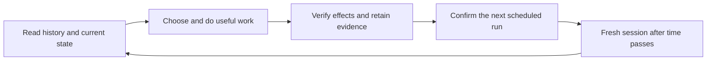

# Long Horizon

**Give an AI agent a responsibility that lasts beyond one conversation.**

Some useful work takes longer than an agent session. Publishing an article is immediate; learning whether it attracts the right readers takes time. Shipping a fix is one step; checking whether it solves the customer's problem is another. Each follow-up needs the context of what was tried, what happened, and what changed since then.

Long Horizon is an agent skill for that cycle: agree on a responsibility, act, retain evidence, arrange a follow-up, and use the results to choose the next useful action. It works with fresh sessions in harnesses such as Codex, Claude Code and Antigravity. The agent can choose objectives within the scope and permissions you establish.

The installed bundle is a `SKILL.md`, supporting instructions and editable templates. History lives in ordinary project files, which the agent searches with its existing tools. V1 operates on one machine.

## Install

Use the [Skills CLI](https://www.skills.sh/docs/cli) from your project directory. It runs through npm's `npx` command:

```sh
npx skills add https://github.com/olliethedev/long-horizon-skill --skill long-horizon
```

Select the harnesses you want to use. The default installation is scoped to the project. To make the skill available across your projects, add `--global`:

```sh
npx skills add https://github.com/olliethedev/long-horizon-skill --skill long-horizon --global
```

The CLI also supports explicit agent selection and installed-skill management; see its [options and supported agents](https://github.com/vercel-labs/skills#options). Load a fresh harness session after installation. For a manual installation, copy the entire [`skills/long-horizon/`](skills/long-horizon/) directory into your harness's documented skill location, keeping its references and assets together.

## Start with a responsibility

Open your agent inside the product repository. In Codex, invoke `$long-horizon`; in harnesses with slash-command skills, select `/long-horizon` from the skill picker. Give it an outcome and any constraints you already know:

```text
$long-horizon Take responsibility for growing organic traffic to our developer documentation site. Create useful new content and improve existing pages, with daily actions. Inspect the project and available analytics, ask me for missing details, and set up ongoing work using Impulse. Keep a record of what you tried and learned so future runs build on it.
```

The skill conducts its own setup conversation, one consequential question at a time. It inspects the project and reuses existing instructions and answers. Together you establish:

- The responsibility, audience, success measures and conditions for ending it.
- What the agent may change, publish, deploy or communicate without asking again.
- Which analytics, feedback, logs and other tools provide evidence.
- How to coordinate with developers and other active responsibilities.
- Any limits, paid-service budgets and authoritative usage sources you supply.
- When to work, where to report, and what requires your intervention.

You can start with a broad request. A separate interview skill, numerical target or monetary budget is optional. Before autonomous operation, the agent makes the brief and first scheduled assignment concrete for review. Standing permission then carries across ordinary follow-ups.

## Why a scheduler is needed—and where Impulse fits

A skill file cannot start a new agent tomorrow. After the current session ends, something must launch the next session with the right project and instructions.

| Piece | Responsibility |
| --- | --- |
| Your agent harness | Reads files, reasons, edits code and uses your connected tools. |
| Long Horizon | Guides setup, evidence gathering, retained history, coordination and decisions across runs. |
| A scheduler | Starts future sessions and lets the agent confirm, move or disable its next run. |

[Impulse](https://github.com/olliethedev/impulse) provides durable local scheduling for scripts and agent assignments. It can launch your configured harness, retain task/run identities, expose execution logs and let a running agent schedule its next observation or disable future work. Long Horizon includes [Impulse guidance](skills/long-horizon/references/impulse.md) and a [task-definition template](skills/long-horizon/assets/task.toml).

To use it, follow [Impulse's installation and setup guide](https://github.com/olliethedev/impulse#build-and-install), configure your harness and terminal, and check the installation with `impulse doctor`. The machine, logged-in environment and configured harness must be available for scheduled execution. Installing Long Horizon alone does not install or configure Impulse.

During setup, the agent [discovers the project's scheduling tools](skills/long-horizon/references/scheduling.md). It reuses an existing suitable scheduler and recommends Impulse when none is configured. An alternative must launch fresh agent sessions with saved context, expose the next run, and support rescheduling and disabling work. Project-specific API budgets remain part of the agent's brief and accounting setup.

## Example responsibilities

Adapt these prompts to your product and available tools. Each begins a setup conversation; the agent resolves missing access, authority and operating details before setting up autonomous work.

### Improve content over time

```text
$long-horizon Grow qualified organic traffic to our API documentation and tutorials. Work daily on useful new articles and improvements to existing pages. Use our search and website analytics, coordinate with documentation changes, and send a weekly digest of actions and evidence. Open PRs for content changes; I will review and publish them.
```

Daily work can include research, writing and technical fixes. Traffic outcomes may need weeks of observation; the agent should choose measurement windows appropriate to the evidence.

### Run revenue experiments

```text
$long-horizon Improve net revenue from our subscription landing pages over the next six weeks. Run at most five page experiments at once, preserve checkout reliability, and account for refunds and cancellations. Ask me which analytics and experiment tools to use and what rollout authority you have. Retain failed and inconclusive attempts as well as wins.
```

### Improve a product from weekly analytics

```text
$long-horizon Take responsibility for reducing friction in our team's project-management app. Each week, review onboarding analytics and customer feedback, choose a useful improvement, implement it within our agreed permissions, and check its effect after rollout. Keep learning across iterations and send a fortnightly progress report.
```

### Follow customer feedback through to resolution

```text
$long-horizon Resolve the recurring incomplete-export complaints from our enterprise customers. Investigate their actual data sizes and failure conditions, implement and verify a fix, then follow up on deployed behavior and customer outcomes. End the assignment when the affected cases are resolved, and preserve the investigation for future regressions.
```

### Monitor a release for bugs

```text
$long-horizon Monitor our new billing release after it reaches production. Review errors and customer reports daily, investigate regressions, and open fixes as PRs. Coordinate with other deployments so we attribute problems to the right change. Finish after fourteen days of verified healthy production behavior, with a final report of fixes and remaining uncertainties.
```

## What carries between runs

Each run reads the agreed brief, current handoff, relevant action history and original evidence, then checks the product's actual state. The agent records what it intended, what actually happened, why it made a decision, and what needs checking next. Later corrections remain connected to the observations and conclusions they change.



History is retained through termination until you explicitly request deletion. Native file tools handle retrieval; an optional index provides navigation and can be rebuilt from the underlying records. See the [workspace structure](skills/long-horizon/references/workspace.md), [history guidance](skills/long-horizon/references/history.md) and [evidence guidance](skills/long-horizon/references/evidence.md).

The agent confirms uncertain external actions before repeating them and coordinates changes that affect other work. A written plan to return later becomes continuation only when the scheduler confirms it.

- **Wait:** useful work or an observation is due later; confirm the next run.
- **Pause:** you need to restore a prerequisite, such as analytics access; disable future work and notify you. Explicitly resume the task after restoring access.
- **Terminate:** a bounded responsibility is fulfilled, impossible within its constraints, or has no useful work left in scope; disable future work and retain the findings. Finishing one feature can still leave an ongoing product-improvement responsibility active.

## Evidence and current limits

This is an experimental workflow. The [earlier full-cycle prototype](prototypes/full-cycle/NOTES.md) and [native-tools comparison](evals/results/native-tools/REPORT.md) exercised continuity, recovery and retrieval, but have **not demonstrated an overall advantage over a capable agent without the skill**. That is an open evaluation question, not a promised benefit.

The [complete-workflow evaluation](evals/results/workflow-value/REPORT.md) started agents from a broad request with empty memory and actual simulated follow-ups. Evaluation was capped at 50 native attempts: revenue has complete comparisons across all three harnesses; weekly-product coverage is partial, and feedback/post-PR cases were not started. The completed pairs again show no demonstrated outcome advantage, with higher native effort in the skill arms. The report retains interruptions, incomplete coverage and uncertainty. Simulated weeks and dense history archives do not establish reliable real-world operation over months or actual revenue lift.

## Development

The distributed skill contains no evaluation programs. Python 3.11+ is needed only for repository development and evaluations:

```sh
python3 -m venv .venv
.venv/bin/pip install -r requirements-dev.txt
.venv/bin/python -m mypy
python3 -m unittest discover -s tests
```

CI runs deterministic tests and type checking without model credentials or a live scheduler. See [CONTRIBUTING.md](CONTRIBUTING.md), [evaluation commands](evals/README.md), [domain terminology](CONTEXT.md) and [design decisions](docs/adr/) for deeper implementation and research context.
